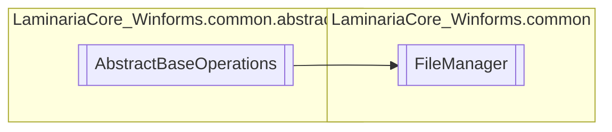

# FileManager `Public class`

## Description
This class implements an interface to interact with a program's file structure
            in a more convenient way.

## Diagram


## Details
### Summary
This class implements an interface to interact with a program's file structure
            in a more convenient way.

### Inheritance
 - [
`AbstractBaseOperations`
](./laminariacore_winformscommonabstraction-AbstractBaseOperations)

### Constructors
#### FileManager
```csharp
public FileManager(string root)
```
##### Arguments
| Type | Name | Description |
| --- | --- | --- |
| `string` | root | The path to the root directory of the file system. |

##### Summary
Main constructor for the FileManager class. Sets the root path to the specified value.
            If not specified, use the AppData/.PROGRAM-NAME folder.

*Generated with* [*ModularDoc*](https://github.com/hailstorm75/ModularDoc)
