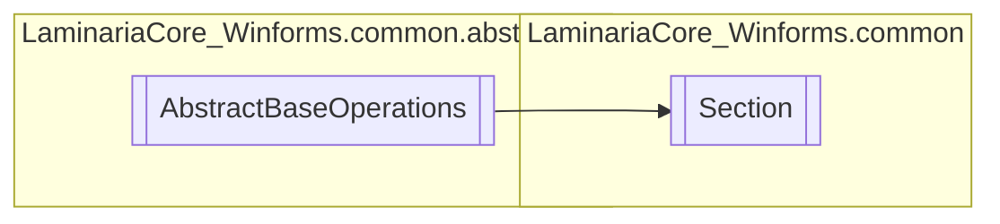

# Section `Public class`

## Description
This class represents a Section inside the File System provided by the FileManager class. It can't
            be instantiated by the user, and will only be accessible through the FileManager.

## Diagram


## Members
### Properties
#### Public  properties
| Type | Name | Methods |
| --- | --- | --- |
| `string` | [`Name`](#name)<br>The section name. | `get, set` |
| `string` | [`SectionFullPath`](#sectionfullpath)<br>The full path for the section. | `get, set` |
| `string` | [`SimpleName`](#simplename)<br>The simplified name of the section. This is the name without the relative path. | `get` |

## Details
### Summary
This class represents a Section inside the File System provided by the FileManager class. It can't
            be instantiated by the user, and will only be accessible through the FileManager.

### Inheritance
 - [
`AbstractBaseOperations`
](./laminariacore_winformscommonabstraction-AbstractBaseOperations)

### Constructors
#### Section
```csharp
internal Section(string sectionPath, string root)
```
##### Arguments
| Type | Name | Description |
| --- | --- | --- |
| `string` | sectionPath | The full path of the section. |
| `string` | root | The full root path of the filesystem |

##### Summary
Main constructor for the Section class. Takes in the root of the file system and the full
            path of the section.

### Properties
#### SectionFullPath
```csharp
public string SectionFullPath { get; set; }
```
##### Summary
The full path for the section.

#### Name
```csharp
public string Name { get; set; }
```
##### Summary
The section name.

#### SimpleName
```csharp
public string SimpleName { get; }
```
##### Summary
The simplified name of the section. This is the name without the relative path.

*Generated with* [*ModularDoc*](https://github.com/hailstorm75/ModularDoc)
