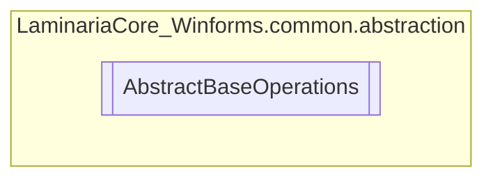

# AbstractBaseOperations `Public class`

## Description
This abstract class implements every method that is used by both the FileManager and Section classes,
            due to a similarity in functionality.

## Diagram


## Members
### Properties
#### Protected  properties
| Type | Name | Methods |
| --- | --- | --- |
| `string` | [`OperationsTargetPath`](#operationstargetpath)<br>The target path to perform these operations on. This will act as the "root" of all operations. | `get, set` |
| `string` | [`RootPath`](#rootpath)<br>The root path of the file system. | `get, set` |

### Methods
#### Public  methods
| Returns | Name |
| --- | --- |
| `string` | [`AddDocument`](#adddocument)(`string` documentName)<br>Adds a document into the current Section if it doesn't exist. |
| [`Section`](./laminariacore_winformscommon-Section) | [`AddSection`](#addsection)(`string` section)<br>Adds a new section (Directory) into the file system. |
| `string``[]` | [`GetAllDocuments`](#getalldocuments)()<br>Iterates over every item stemming from the relative root used, filters out the files<br>            and returns an array with their full paths. |
| [`Section`](./laminariacore_winformscommon-Section)`[]` | [`GetAllSections`](#getallsections)()<br>Recursively searches for every section in the file system, and returns an array containing them. |
| `string``[]` | [`GetAllTopLevelDocuments`](#getalltopleveldocuments)()<br>Iterates over every top level item in the operations target path and<br>            returns an array with their full paths. |
| [`Section`](./laminariacore_winformscommon-Section)`[]` | [`GetAllTopLevelSections`](#getalltoplevelsections)()<br>Searches for every top level section in the file system, and returns an array containing them. |
| `string``[]` | [`GetDocumentsNamed`](#getdocumentsnamed)(`string` filename)<br>Iterates over all the files stemming from the relative root and returns every name matched file. |
| `string` | [`GetFirstDocumentNamed`](#getfirstdocumentnamed)(`string` filename)<br>Iterates over all the files stemming from the relative root and returns the first name matched file. |
| [`Section`](./laminariacore_winformscommon-Section) | [`GetFirstSectionNamed`](#getfirstsectionnamed)(`string` name)<br>Gets all the sections (Directories) in the file system, and returns the first one with a matching name. |
| [`Section`](./laminariacore_winformscommon-Section)`[]` | [`GetSectionsNamed`](#getsectionsnamed)(`string` name)<br>Gets all the sections (Directories) in the file system, and returns the ones matching<br>            the specified name. |
| `void` | [`RemoveDocument`](#removedocument)(`string` documentName)<br>Deletes a document from within a section, based on its relative path. |
| `void` | [`RemoveSection`](#removesection)(`string` section)<br>Removes a section (Directory) from the file system. |

#### Private  methods
| Returns | Name |
| --- | --- |
| [`Section`](./laminariacore_winformscommon-Section) | [`<GetAllSections>b__11_0`](#getallsectionsb110)(`string` x) |
| [`Section`](./laminariacore_winformscommon-Section) | [`<GetAllTopLevelSections>b__12_0`](#getalltoplevelsectionsb120)(`string` x) |

## Details
### Summary
This abstract class implements every method that is used by both the FileManager and Section classes,
            due to a similarity in functionality.

### Constructors
#### AbstractBaseOperations
```csharp
internal AbstractBaseOperations(string operationsTargetPath)
```
##### Arguments
| Type | Name | Description |
| --- | --- | --- |
| `string` | operationsTargetPath | @link{AbstractBaseOperations.OperationsTargetPath} |

##### Summary
Main constructor for the AbstractBaseOperations class. Defines the
            operations target path.

### Methods
#### AddSection
```csharp
public Section AddSection(string section)
```
##### Arguments
| Type | Name | Description |
| --- | --- | --- |
| `string` | section | The relative path of the section, relative to the root. |

##### Summary
Adds a new section (Directory) into the file system.

##### Returns
The section that was just added

#### RemoveSection
```csharp
public void RemoveSection(string section)
```
##### Arguments
| Type | Name | Description |
| --- | --- | --- |
| `string` | section | The relative path of the section, relative to the root. |

##### Summary
Removes a section (Directory) from the file system.

#### GetAllSections
```csharp
public Section GetAllSections()
```
##### Summary
Recursively searches for every section in the file system, and returns an array containing them.

##### Returns
A Section[] containing the Section objects representing the directories.

#### GetAllTopLevelSections
```csharp
public Section GetAllTopLevelSections()
```
##### Summary
Searches for every top level section in the file system, and returns an array containing them.

##### Returns
A Section[] containing the Section objects representing the directories.

#### GetSectionsNamed
```csharp
public Section GetSectionsNamed(string name)
```
##### Arguments
| Type | Name | Description |
| --- | --- | --- |
| `string` | name | The name of the sections to search for. |

##### Summary
Gets all the sections (Directories) in the file system, and returns the ones matching
            the specified name.

##### Returns
A Section[] containing the objects representing each directory in the file system.

#### GetFirstSectionNamed
```csharp
public Section GetFirstSectionNamed(string name)
```
##### Arguments
| Type | Name | Description |
| --- | --- | --- |
| `string` | name | The name of the sections to search for. |

##### Summary
Gets all the sections (Directories) in the file system, and returns the first one with a matching name.

##### Returns
A Section object representing the directory in the file system.

#### AddDocument
```csharp
public string AddDocument(string documentName)
```
##### Arguments
| Type | Name | Description |
| --- | --- | --- |
| `string` | documentName | The name of the document to add into the section |

##### Summary
Adds a document into the current Section if it doesn't exist.

##### Returns
The path of the document that was just added

#### RemoveDocument
```csharp
public void RemoveDocument(string documentName)
```
##### Arguments
| Type | Name | Description |
| --- | --- | --- |
| `string` | documentName | The name of the document to remove from the section |

##### Summary
Deletes a document from within a section, based on its relative path.

#### GetAllDocuments
```csharp
public string GetAllDocuments()
```
##### Summary
Iterates over every item stemming from the relative root used, filters out the files
            and returns an array with their full paths.

##### Returns
A string[] containing every file stemming down from the root

#### GetAllTopLevelDocuments
```csharp
public string GetAllTopLevelDocuments()
```
##### Summary
Iterates over every top level item in the operations target path and
            returns an array with their full paths.

##### Returns
A string[] containing every top level file at the target path

#### GetDocumentsNamed
```csharp
public string GetDocumentsNamed(string filename)
```
##### Arguments
| Type | Name | Description |
| --- | --- | --- |
| `string` | filename | The filename to match with |

##### Summary
Iterates over all the files stemming from the relative root and returns every name matched file.

##### Returns
A string[] with all the files that matched the filename

#### GetFirstDocumentNamed
```csharp
public string GetFirstDocumentNamed(string filename)
```
##### Arguments
| Type | Name | Description |
| --- | --- | --- |
| `string` | filename | The filename to match with |

##### Summary
Iterates over all the files stemming from the relative root and returns the first name matched file.

##### Returns
A string containing the full path of the first matched file

#### <GetAllSections>b__11_0
```csharp
private Section <GetAllSections>b__11_0(string x)
```
##### Arguments
| Type | Name | Description |
| --- | --- | --- |
| `string` | x |   |

#### <GetAllTopLevelSections>b__12_0
```csharp
private Section <GetAllTopLevelSections>b__12_0(string x)
```
##### Arguments
| Type | Name | Description |
| --- | --- | --- |
| `string` | x |   |

### Properties
#### OperationsTargetPath
```csharp
protected string OperationsTargetPath { get; set; }
```
##### Summary
The target path to perform these operations on. This will act as the "root" of all operations.

#### RootPath
```csharp
protected string RootPath { get; set; }
```
##### Summary
The root path of the file system.

*Generated with* [*ModularDoc*](https://github.com/hailstorm75/ModularDoc)
