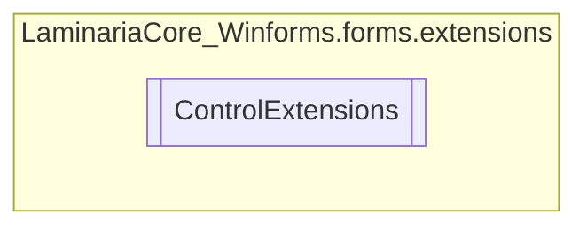

# ControlExtensions `Public class`

## Description
This class is used to extend the functionality of every control in Windows Forms.

## Diagram


## Members
### Methods
#### Public Static methods
| Returns | Name |
| --- | --- |
| `void` | [`ForceCache`](#forcecache)(`Control` self)<br>Force the caching of the original parent of the control. You're most likely doing something wrong if you're using this method. It shouldn't be<br>            used by you in 99% of the cases, but it's here for that 1%.<br>            If you're using this method, make sure you know what you're doing. |
| `bool` | [`IsCached`](#iscached)(`Control` self)<br>Checks whether the control is already contained in the cache. |
| `void` | [`SendToOriginal`](#sendtooriginal)(`Control` self)<br>Searches for the original parent of the control inside OriginalParentCache, and sets the control's<br>            parent back to it. |

## Details
### Summary
This class is used to extend the functionality of every control in Windows Forms.

### Methods
#### SendToOriginal
```csharp
public static void SendToOriginal(Control self)
```
##### Arguments
| Type | Name | Description |
| --- | --- | --- |
| `Control` | self | The control the method is being called from |

##### Summary
Searches for the original parent of the control inside OriginalParentCache, and sets the control's
            parent back to it.

#### IsCached
```csharp
public static bool IsCached(Control self)
```
##### Arguments
| Type | Name | Description |
| --- | --- | --- |
| `Control` | self | The control the method is being called from |

##### Summary
Checks whether the control is already contained in the cache.

##### Returns
Whether the control is cached or not.

#### ForceCache
```csharp
public static void ForceCache(Control self)
```
##### Arguments
| Type | Name | Description |
| --- | --- | --- |
| `Control` | self | The control the method is being called from |

##### Summary
Force the caching of the original parent of the control. You're most likely doing something wrong if you're using this method. It shouldn't be
            used by you in 99% of the cases, but it's here for that 1%.
            If you're using this method, make sure you know what you're doing.

*Generated with* [*ModularDoc*](https://github.com/hailstorm75/ModularDoc)
