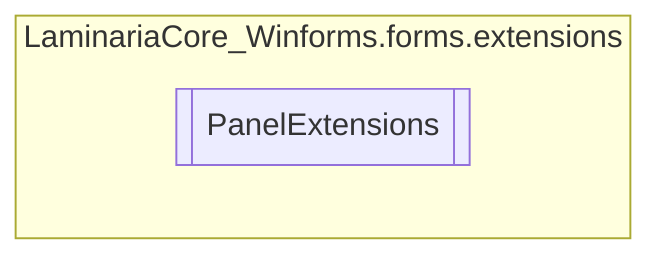

# PanelExtensions `Public class`

## Description
This class implements methods to extend the functionality of Panels in Windows Forms.

## Diagram


## Members
### Methods
#### Public Static methods
| Returns | Name |
| --- | --- |
| `void` | [`AddAllFrom`](#addallfrom)(`Panel` self, `Panel` targetPanel)<br>This extension method is used to add the contents from an external panel into<br>            the current panel. |
| `void` | [`SetAllFrom`](#setallfrom)(`Panel` self, `Panel` targetPanel)<br>Replaces all the controls from the current panel with the controls from the target panel. |

## Details
### Summary
This class implements methods to extend the functionality of Panels in Windows Forms.

### Methods
#### AddAllFrom
```csharp
public static void AddAllFrom(Panel self, Panel targetPanel)
```
##### Arguments
| Type | Name | Description |
| --- | --- | --- |
| `Panel` | self | The panel the method is being called from |
| `Panel` | targetPanel | The panel to add the contents of |

##### Summary
This extension method is used to add the contents from an external panel into
            the current panel.

#### SetAllFrom
```csharp
public static void SetAllFrom(Panel self, Panel targetPanel)
```
##### Arguments
| Type | Name | Description |
| --- | --- | --- |
| `Panel` | self | The panel the method is being called from |
| `Panel` | targetPanel | The panel to clone the contents of |

##### Summary
Replaces all the controls from the current panel with the controls from the target panel.

*Generated with* [*ModularDoc*](https://github.com/hailstorm75/ModularDoc)
