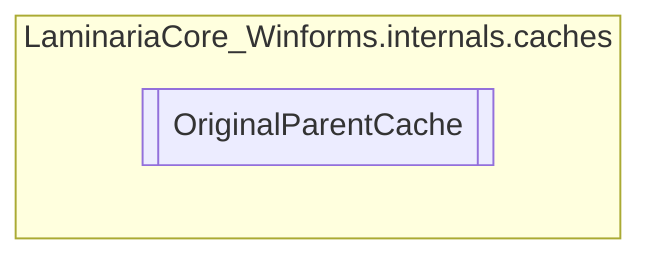

# OriginalParentCache `Internal class`

## Description
This singleton internal class implements a cache that stores every control's original
            parent, so that the dynamic loading/unloading of active components can be managed smoothly.

## Diagram


## Members
### Methods
#### Internal  methods
| Returns | Name |
| --- | --- |
| `bool` | [`AddToCache`](#addtocache)(`Control` control)<br>Adds the specified control to the cache, in the form of a name:parent mapping. |
| `bool` | [`Contains`](#contains)(`string` name)<br>Checks if the specified control is cached. |
| `Control` | [`GetParentOf`](#getparentof)(`string` name)<br>Returns the parent of the specified control, as it was before it was added to the cache. |

## Details
### Summary
This singleton internal class implements a cache that stores every control's original
            parent, so that the dynamic loading/unloading of active components can be managed smoothly.

### Constructors
#### OriginalParentCache [1/2]
```csharp
private OriginalParentCache()
```

#### OriginalParentCache [2/2]
```csharp
private static OriginalParentCache()
```

### Fields
#### INSTANCE
```csharp
public static  INSTANCE
```
##### Summary
The instance used to access the class, since it is a singleton.

#### cache
```csharp
private  cache
```
##### Summary
The cache containing the original parents of every control.

### Methods
#### AddToCache
```csharp
internal bool AddToCache(Control control)
```
##### Arguments
| Type | Name | Description |
| --- | --- | --- |
| `Control` | control | The control to add to the cache. |

##### Summary
Adds the specified control to the cache, in the form of a name:parent mapping.

##### Returns
Whether or not the control was successfully added to cache.

#### GetParentOf
```csharp
internal Control GetParentOf(string name)
```
##### Arguments
| Type | Name | Description |
| --- | --- | --- |
| `string` | name | The name of the control to look for in the cache |

##### Summary
Returns the parent of the specified control, as it was before it was added to the cache.

##### Returns
The cached original parent for the specified name

#### Contains
```csharp
internal bool Contains(string name)
```
##### Arguments
| Type | Name | Description |
| --- | --- | --- |
| `string` | name | The control name to check for in the cache. |

##### Summary
Checks if the specified control is cached.

##### Returns
Whether the control exists in the cache or not.

*Generated with* [*ModularDoc*](https://github.com/hailstorm75/ModularDoc)
